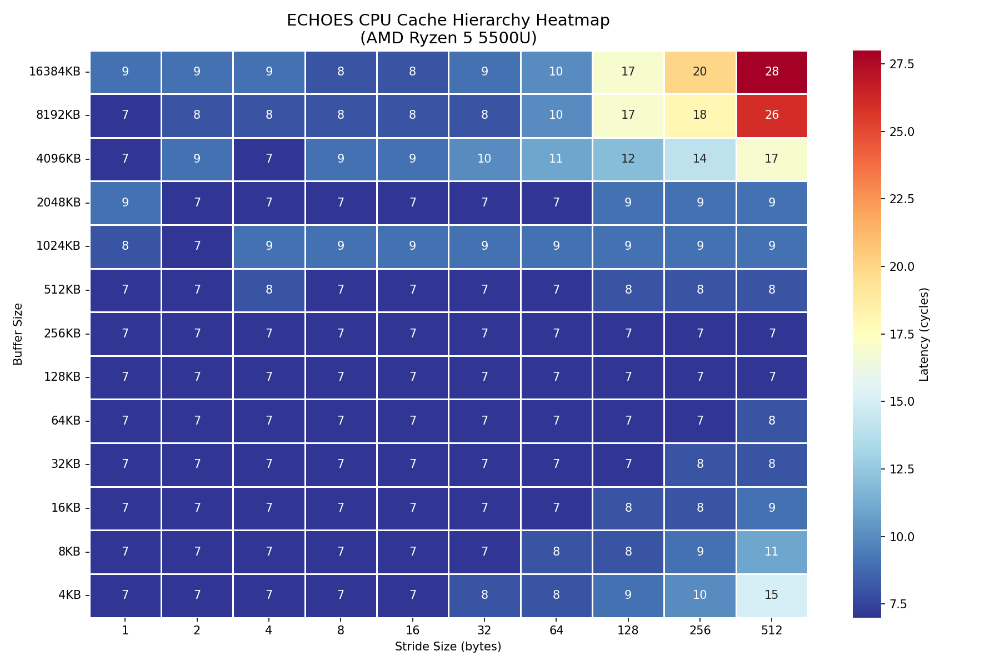

# ECHOES

A tool that experimentally maps your CPU's cache hierarchy by stressing memory with different access patterns and visualizing latency and cache behavior.

## What it measures

- **Cache size sweep**  detects L1/L2/L3 boundaries empirically using pointer chasing
- **Cache line size** detects 64 byte cache line boundary using stride sweep
- **False sharing**  measures penalty of cache line contention between threads
- **TLB detection**  detects TLB overflow boundary using page-stride access


## Heatmap Output




## Sample Output

### Cache Hierarchy Detection
```
size: 4KB    cycles: 16    ← L1 cache
size: 8KB    cycles: 16    ← L1 cache
size: 64KB   cycles: 20    ← L2 cache
size: 512KB  cycles: 32    ← L2 cache
size: 1MB    cycles: 45    ← L3 cache
size: 4MB    cycles: 100   ← L3 cache
size: 8MB    cycles: 265   ← RAM (L3 boundary hit)
size: 16MB   cycles: 352   ← RAM
```
*Tested on AMD Ryzen 5 5500U (L1: 32KB, L2: 512KB, L3: 8MB)*

### Cache hierarchy
```
size: 4KB    cycles: 16    ← L1
size: 64KB   cycles: 20    ← L2 boundary
size: 512KB  cycles: 32    ← L2
size: 1MB    cycles: 45    ← L3 boundary
size: 4MB    cycles: 100   ← L3
size: 8MB    cycles: 265   ← RAM
```

### Cache line size detection
```
stride: 1    cycles: 63
stride: 32   cycles: 84
stride: 64   cycles: 231   ← jump here = 64 byte cache line confirmed
stride: 128  cycles: 273
```

### False sharing
```
with false sharing:    156,282,756 cycles
without false sharing:  44,087,736 cycles
penalty: 3.5x slower
```

### TLB detection
```
size: 256KB  cycles: 14   ← TLB hits
size: 2MB    cycles: 16   ← TLB getting full
size: 4MB    cycles: 51   ← TLB overflow!
size: 8MB    cycles: 76   ← every access = TLB miss
```

---

---

## Build & Run
```bash
g++ -O0 -o echoes src/main.cpp src/measurements/cache_size.cpp \
src/measurements/cache_line.cpp src/measurements/false_sharing.cpp \
src/measurements/tlb.cpp src/measurements/heatmap_sweep.cpp \
src/output/csv_writer.cpp src/utils/timer.cpp -lpthread

./echoes
python3 scripts/plot.py
```

---


---

## Build
```bash
g++ -O0 -o echoes src/main.cpp src/measurements/cache_line.cpp src/measurements/false_sharing.cpp src/utils/timer.cpp -lpthread
./echoes
```
